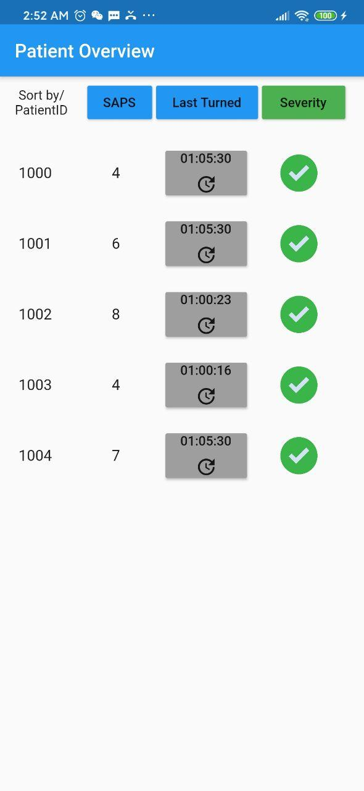

# Covid19 Patient Monitoring

This project fetches live ventilator data of Covid19 patients from a server, analyzes it, and displays it to a doctor via an iOS/Android app. 

The hybrid Frontend code can be compiled to both an Android and iOS application using Flutter. The Backend code runs with Python. 

## Features   

### Main Screen  
- Overview of all patients, real-time monitoring of Last Turned, SAPS, and Severity Score
- Buttons for turning patients and updating information on the server 
     

### Patient Screen
- Real-time, dynamic chart of a patient's health data
- 4 different tabs of relevant data
- User can input the number of last values to be displayed, the chart automatically adjusts
- Trigger settings listed below the chart
- Real-Time Monitoring of Severity score on the top of the screen
     

### Other features
- Detailed Patient Information
- App listens to changes in patient's severity status in the background
- App sends an SMS to a specified emergency contact when a patient's status gets critical

## Getting Started

### Backend

1. Run **app.py** on the server.

### Frontend

1. Insert your server URLs in **fetchjson.dart**.
2. Install .apk [(Download)](https://syncandshare.lrz.de/getlink/fiRNvKLNrZH6kzeLAfhJgSkt/app.apk) directly or compile the code to an Android or iOS App using [Flutter](https://flutter.dev/docs/get-started/install)
    - Download and Install [Flutter](https://flutter.dev) 
    - Clone this repository
    - `cd` into the repository folder.
    - run `flutter run-android` or `flutter run-ios` to build the app
